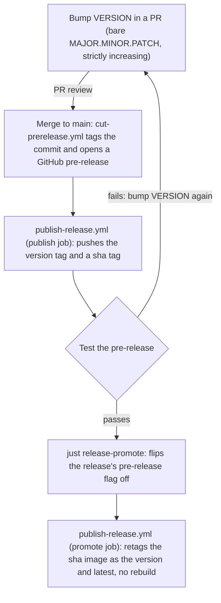

# Releasing

How a version goes from a `VERSION` bump to a released Docker Hub image.

## The model

`VERSION` (repo root) is the single source of truth for what gets released. It holds a bare
`MAJOR.MINOR.PATCH` (never `-rc1`, `-alpha`, etc.), and the commit that bumps it is the exact
commit that gets tagged and released. There is one tag and one GitHub release object per
version, from the moment `VERSION` is bumped through to the final promoted release.
"Pre-release" vs. "release" is GitHub's own checkbox on that one object, not a different tag.

A failed pre-release burns a version number: if `0.0.5`'s pre-release fails testing, the fix
goes out as `0.0.6`, never a re-spun `0.0.5`.

## The pipeline

1. **Bump `VERSION`** in a PR to a bare, strictly-increasing `MAJOR.MINOR.PATCH` (e.g.
   `0.0.4` → `0.0.5`). `version-format-check.yml` enforces the format, the no-prerelease-
   suffix rule, and the increment on every PR that touches it.
2. **Merge it.** That push to `main` triggers `cut-prerelease.yml`, which re-validates
   VERSION and tags that commit `v0.0.5`, opening a GitHub **pre-release** for it.
3. **`publish-release.yml` picks up the new pre-release** (it triggers on `release: published`)
   and pushes `newrelic/network-agent:0.0.5` and `newrelic/network-agent:sha-<commit>`. Both
   tags are immutable from this point on.
4. **Test it.** Pull `0.0.5` (or the `sha-<commit>` tag), run canary/manual testing, whatever
   this release needs.
   - If it fails: fix the problem, bump `VERSION` again (`0.0.6`), and go back to step 1.
     Never reuse or move the `v0.0.5` tag.
   - If it passes: promote it.
5. **Promote:** `just release-promote 0.0.5`, or equivalently, edit the `v0.0.5` release on
   GitHub and uncheck "This is a pre-release." Either way, this flips that release object's
   pre-release flag off, which fires GitHub's `released` event.
   `publish-release.yml`'s `promote` job picks that up and retags the already-pushed
   `sha-<commit>` image as `0.0.5` and `latest`. No rebuild: what ships as the release is
   byte-for-byte what was tested in step 4.

PR review gates cutting a candidate (steps 1-2); the deliberate act of running
`release-promote` gates promoting it (step 5).

## `just release-promote <version>`

Wraps step 5. Before touching anything, it checks:

- A GitHub release for `v<version>` exists and is currently marked pre-release.
- (Best-effort, non-fatal) `publish-release.yml` actually completed successfully for that
  tag — if this can't be confirmed you get a warning, not a hard stop, since the `promote`
  job's own Docker Hub check is the real, unskippable gate.

Then it runs `gh release edit v<version> --prerelease=false`.

Needs `gh` authenticated (`gh auth login` — available in `nix develop`'s devShell).

## Ad-hoc builds

`publish-release.yml` also accepts a `workflow_dispatch` input for a one-off build+push
outside this pipeline. It never touches `VERSION`, never tags anything, and never promotes —
use it for a throwaway build, not a real release.
