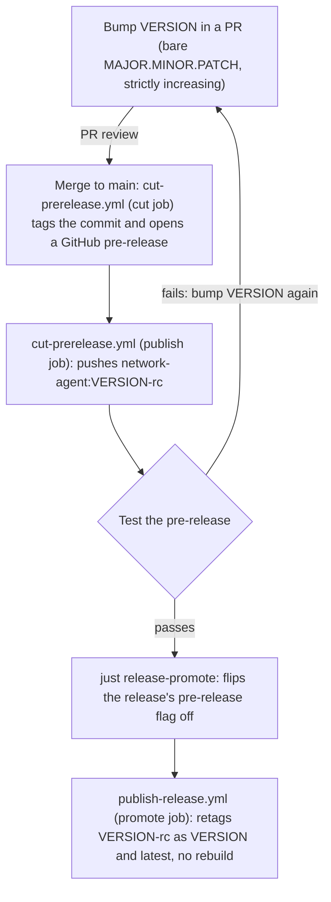

# Releasing

How a version goes from a `VERSION` bump to a released Docker Hub image.

## The model

`VERSION` (repo root) is the single source of truth for what gets released. It holds a bare
`MAJOR.MINOR.PATCH` (never `-rc1`, `-alpha`, etc.), and the commit that bumps it is the exact
commit that gets tagged and released. There is one tag and one GitHub release object per
version, from the moment `VERSION` is bumped through to the final promoted release.
"Pre-release" vs. "release" is GitHub's own checkbox on that one object, not a different tag.

The Docker Hub tag does carry a `-rc` suffix during the pre-release phase, though --
`network-agent:0.0.5-rc`, not `network-agent:0.0.5`. `VERSION` is never bumped twice for the
same release, so `0.0.5-rc` is already unique and immutable on its own, which is what lets
promotion retag it directly as the bare `0.0.5` (and `latest`) without a separate
content-addressed tag to link the two. Net effect: `network-agent:0.0.5` only exists once
`0.0.5` has actually been promoted -- pulling a bare version number is never pulling
something unvetted.

A failed pre-release burns a version number: if `0.0.5`'s pre-release fails testing, the fix
goes out as `0.0.6`, never a re-spun `0.0.5`.

## The pipeline

1. **Bump `VERSION`** in a PR to a bare, strictly-increasing `MAJOR.MINOR.PATCH` (e.g.
   `0.0.4` → `0.0.5`). `version-format-check.yml` enforces the format, the no-prerelease-
   suffix rule, and the increment on every PR that touches it -- and that the PR touches
   `VERSION` *only*. The bumping commit is the exact commit that gets tagged and released,
   so it can't also carry unrelated code, reviewed only as "a version bump."
2. **Merge it.** That push to `main` triggers `cut-prerelease.yml`'s `cut` job, which
   re-validates VERSION and tags that commit `v0.0.5`, opening a GitHub **pre-release** for
   it.
3. **`cut-prerelease.yml`'s `publish` job** (`needs: cut`, same workflow run) immediately
   builds and pushes `newrelic/network-agent:0.0.5-rc`. That tag is immutable from this
   point on. This is deliberately one workflow with two jobs, not two workflows chained
   through a `release` event: GitHub doesn't fire a new workflow run for an event created by
   the repository's own `GITHUB_TOKEN` (recursion prevention), and creating the release is
   exactly such an event -- a separate workflow reacting to `release: published` would need
   its own non-`GITHUB_TOKEN` credential just to exist. Keeping `cut` and `publish` in one
   workflow sidesteps that entirely.
4. **Test it.** Pull `0.0.5-rc`, run canary/manual testing, whatever this release needs.
   - If it fails: fix the problem, bump `VERSION` again (`0.0.6`), and go back to step 1.
     Never reuse or move the `v0.0.5` tag.
   - If it passes: promote it.
5. **Promote:** `just release-promote 0.0.5`, or equivalently, edit the `v0.0.5` release on
   GitHub and uncheck "This is a pre-release." Either way, this flips that release object's
   pre-release flag off, which fires GitHub's `released` event.
   `publish-release.yml`'s `promote` job picks that up and retags the already-pushed
   `0.0.5-rc` image as `0.0.5` and `latest`. No rebuild: what ships as the release is
   byte-for-byte what was tested in step 4. This step never had the `GITHUB_TOKEN` problem,
   since it runs under a human's own `gh auth login` session.

PR review gates cutting a candidate and building its image (steps 1-3); the deliberate act
of running `release-promote` gates promoting it (step 5).

## `just release-promote <version>`

Wraps step 5. Before touching anything, it checks:

- A GitHub release for `v<version>` exists and is currently marked pre-release.
- (Best-effort, non-fatal) `publish-release.yml` actually completed successfully for that
  tag — if this can't be confirmed you get a warning, not a hard stop, since the `promote`
  job's own Docker Hub check is the real, unskippable gate.

Then it runs `gh release edit v<version> --prerelease=false`.

Needs `gh` authenticated (`gh auth login` — available in `nix develop`'s devShell).

## Ad-hoc builds

Neither `cut-prerelease.yml` nor `publish-release.yml` has a `workflow_dispatch` trigger --
the only way to get a real `<version>-rc`/`<version>`/`latest` tag pushed is through the
pipeline above. A separate workflow, `push-adhoc-image.yml`, covers a one-off build+push
outside a real release: give it a `tag` input, and `just check-adhoc-tag` rejects it before
anything builds if it's valid SemVer or literally `latest` -- an ad-hoc tag must not be
confusable with a real release. It never touches `VERSION`, never creates a tag/release, and
never promotes.

## Tampering safeguards

Two independent things stop someone with write access from pushing a real image outside the
pipeline above, without going through a reviewed VERSION-bump PR:

- **Tag protection.** A repository ruleset on `v*.*.*` restricts updates, deletions, and
  force pushes on release tags to nobody at all -- not even admins. Once a version's tag is
  cut, it's immutable; a failed pre-release burns the version rather than moving or
  recreating its tag. Creation is deliberately *not* restricted yet: `cut-prerelease.yml`
  authenticates as the `github-actions[bot]` system account, which GitHub's ruleset bypass
  list has no way to grant an exception to (it isn't a GitHub App, user, or repo role) --
  doing so today would just break the automation. Revisit this if/when a dedicated bypass
  identity (a GitHub App, or a bot account's PAT) is set up for it.
- **Tag/VERSION cross-check.** Since tag creation isn't restricted, someone with write
  access could still create a release directly on GitHub (bypassing `cut-prerelease.yml`
  entirely) with an arbitrary tag on an arbitrary commit -- and since `publish-release.yml`
  reacts to `released`, not just an edit of a release *this* pipeline created, that path
  reaches it. Its `version` job verifies that the release's tag matches the checked-in
  `VERSION` file at the exact commit the release points to, and refuses to promote/retag
  otherwise. A real release, cut by `cut-prerelease.yml`, always has this hold, since it
  tags the exact commit that bumped `VERSION` to that value.

## SemVer checks

Format validation and version comparison are Justfile recipes, not Nix outputs -- `nix` (via
`flake.nix`) is for packages, the devShell, and checks complex enough to need Nix's own
machinery (the NixOS VM tests), not for thin shell wrappers around `semver-tool`
(fsaintjacques/semver-tool). They assume `semver-tool` is already on `PATH` rather than
calling `nix run nixpkgs#semver-tool` themselves, which would resolve against the global
flake registry's nixpkgs instead of this repo's own pinned one -- so every caller, human or
CI, runs them through the devShell (`nix develop` interactively, or `nix develop --command
just <recipe>` from CI), never a bare `nix run nixpkgs#just -- <recipe>`.

- `just check-semver <string>` — is `<string>` valid SemVer? Rejects `+build-metadata` too:
  this repo doesn't use it anywhere.
- `just check-version-increment <old> <new>` — is `<new>` a strict SemVer increase over
  `<old>`?
- `just check-version` — is the checked-in `VERSION` file itself valid SemVer? (`just
  check-semver` applied to `VERSION`'s content.)
- `just check-adhoc-tag <tag>` — the inverse of `check-semver`, plus rejecting `latest`: used
  by `push-adhoc-image.yml` above.
